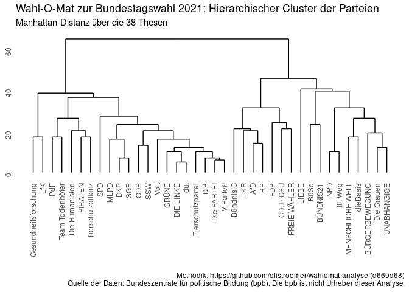

Analysen zum Wahl-O-Mat Bundestag 2021
================
Oliver Stroemer
2021-09-06

## Abstract

Wie zu jeder größeren Wahl hat die [Bundeszentrale für politische
Bildung (bpb)](https://www.bpb.de/) einen
[Wahl-O-Mat](https://www.wahl-o-mat.de/) für die [Wahl zum 20. Deutschen
Bundestag](https://de.wikipedia.org/wiki/Bundestagswahl_2021) zur
Verfügung gestellt. Grundlage sind 38 Thesen zu denen sich 38 der zur
Wahl stehenden Parteien begründet positioniert haben.

In diesem Bericht sollen Zusammenhänge zwischen Parteien und Thesen
aufgezeigt und die dabei verwendete Methodik zur Diskussion gestellt
werden. Es wird keine politische Agenda verfolgt und lediglich auf der
Grundlage von Daten argumentiert.

Der Autor freut sich über Ideen, Verbesserungen, Ratschläge im Rahmen
sachlicher Kritik gerne auch als Pull-Request an dieses Repository.

## Herunterladen der Daten

Die
[Rohdaten](https://www.bpb.de/politik/wahlen/wahl-o-mat/bundestagswahl-2021/337541/download)
können direkt bei der bpb heruntergeladen werden.

``` r
if (!dir.exists("data")){
        dir.create("data")
}
if (!file.exists("data/bundestag_v1.01.zip")){
        download.file("https://www.bpb.de/system/files/datei/Wahl-O-Mat%20Bundestag%202021_Datensatz_v1.01.zip"
                      ,"data/bundestag_v1.01.zip")
}
if (!file.exists("data/Wahl-O-Mat Bundestag 2021_Datensatz_v1.01.xlsx")){
        unzip("data/bundestag_v1.01.zip", exdir = "data")
}
```

## Einlesen der Daten und Aufbereitung

``` r
ds <- read_xlsx("data/Wahl-O-Mat Bundestag 2021_Datensatz_v1.01.xlsx", sheet = 3) %>%
        rename(partei = `Partei: Kurzbezeichnung`) %>%
        #filter(partei %in% c("CDU / CSU", "GRÜNE", "SPD", "AfD", "DIE LINKE", "FDP")) %>%
        mutate(position = as.numeric(factor(`Position: Position`
                                            ,levels = c("stimme nicht zu"
                                                        ,"neutral"
                                                        ,"stimme zu"))))
```

## Cluster der Parteien

Die Parteien werden danach zusammengefasst, wie viele Schritte zwei
Parteien auf einander zugehen müssen, um zu allen Thesen diesselbe
Position zu vertreten. Hierbei wird auf eine Betrachtung der
Begründungen verzichtet.

Stimmt eine Partei X einer These zu und eine Partei Y lehnt diese ab,
müssten die Parteien zwei Schritte aufeinander zugehen, um diesselbe
Meinung zu vertreten. Entweder eine Partei geht zwei Schritte auf die
andere zu (beide Parteien stimmen zu bzw. lehnen sie ab) oder beide
Parteien gehen jeweils einen Schritt und treffen sich auf einer
neutralen Position in der Mitte.

Problematisch bei dieser Herangehensweise ist, dass nicht sicher ist,
dass die Thesen unabhängige Dimensionen beschreiben. Eine
Meinungsänderung zu einer These kann auch den Standpunkt zu anderen
Thesen implizit verschieben, sodass eine kleinere Distanz zwischen zwei
Parteien liegen kann, als die nicht auf Abhängigkeiten zwischen Thesen
normalisierte Betrachtung vermuten lassen mag.

``` r
thesen <- ds %>%
        pivot_wider(id_cols = partei
                    ,names_from = `These: Titel`
                    ,values_from = position) %>%
        column_to_rownames(var = "partei")

# Manhattan distance
dc <- dist(thesen, diag=T, method = 'manhattan')

# Hierarchical Clustering
hc <- hclust(dc)

# Plot
ggdendrogram(hc) +
        labs(title = "Wahl-O-Mat zur Bundestagswahl 2021: Hierarchischer Cluster der Parteien"
             ,subtitle = "Manhattan-Distanz über die 38 Thesen"
             ,caption = caption)
```

<!-- -->

Es werden zwei große Cluster deutlich, die die Parteienlandschaft in
einen “linken” und einen “rechten” Block spalten.

Die kleinste Distanz liegt zwischen der etablierten Partei “DIE LINKE”
und der noch nicht im Bundestag vertretenen “Die Urbane. Eine HipHop
Partei (du.)”. Im Folgenden wird eine [Übersicht der unterschiedlichen
Thesen](tables/linkedu.md) mit den Begründungen der beiden Parteien
generiert.

``` r
linkedu <- ds %>% filter(partei %in% c("DIE LINKE", "du.")) %>%
        pivot_wider(id_cols = `These: Titel`
                    ,names_from = partei
                    ,values_from = c(`Position: Position`, `Position: Begründung`)) %>%
        filter(`Position: Position_DIE LINKE` != `Position: Position_du.`)

cat(knitr::kable(linkedu), file='tables/linkedu.md')
```

## Weitere Ideen

  - Clustern und Isolierung unabhängiger Kernthesen
  - Welche Thesen bergen das größte Konfliktpotenzial, wo herrscht
    bereits ein Konsens?
  - …
